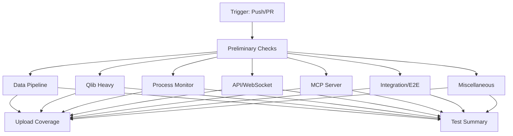

# CI/CD Pipeline

## Overview

This document describes the Continuous Integration and Continuous Deployment (CI/CD) pipeline for the Qlib Crypto Trading Platform. The pipeline uses GitHub Actions to automate testing, linting, and Docker builds.

## Pipeline Architecture

### Workflows

| Workflow | Trigger | Purpose | Duration |
|----------|---------|---------|----------|
| **Test Suite** | Push/PR to master, main, develop | Run all tests in parallel shards | ~10-15 min |
| **Lint** | Push/PR to master, main, develop | Code quality checks (Black, Flake8, MyPy) | ~3-5 min |
| **Docker Build** | Push/PR affecting Docker files | Validate Docker images | ~5-8 min |

### Test Sharding Strategy

Tests are divided into 7 parallel shards for optimal performance:

1. **Data Pipeline** (~5 tests) - Data ingestion, validation, conversion
2. **Qlib Heavy** (~5 tests) - Model training, backtesting (CPU-intensive)
3. **Process Monitor** (~93 tests) - Process tracking, workflow monitoring
4. **API/WebSocket** (~7 tests) - REST API, WebSocket communication
5. **MCP Server** (~11 tests) - MCP protocol, tools, resources
6. **Integration/E2E** (~7 tests) - End-to-end workflows
7. **Miscellaneous** (~6 tests) - Device management, security, UX

**Total:** 356 tests across 7 parallel jobs

## Test Workflow (.github/workflows/test.yml)

### Architecture



### Jobs

#### Preliminary Checks
**Purpose:** Fast-fail for basic issues before running full test suite

- Validates pytest collection (no syntax errors)
- Ensures all test files are discoverable
- **Duration:** ~1-2 minutes
- **Runs on:** ubuntu-latest, Python 3.13

#### Test Shards (7 parallel jobs)
Each shard runs independently with:
- Python 3.13 on ubuntu-latest
- Full dependency installation
- Coverage reporting per shard
- 10-15 minute timeout
- `--tb=short` for concise error output

**Environment Variables:**
```yaml
SETUPTOOLS_SCM_PRETEND_VERSION: "0.9.8"  # Bypass SCM version detection
```

#### Test Summary
**Purpose:** Aggregate results and fail if any shard failed

- Displays result of each shard
- Fails if any shard != "success"
- Provides clear pass/fail status

### Coverage Reporting

Each test shard uploads coverage to [Codecov](https://codecov.io) with flags:
- `data-pipeline`
- `qlib-heavy`
- `process-monitor`
- `api-websocket`
- `mcp-server`
- `integration-e2e`
- `miscellaneous`

**Coverage Configuration:**
```yaml
- name: Upload coverage reports
  uses: codecov/codecov-action@v4
  with:
    file: ./coverage.xml
    flags: <shard-name>
    name: <shard-name>-coverage
```

**Setup Codecov:**
1. Sign up at https://codecov.io
2. Connect GitHub repository
3. Add `CODECOV_TOKEN` to repository secrets (optional for public repos)
4. Coverage reports appear automatically on PRs

## Lint Workflow (.github/workflows/lint.yml)

### Jobs

#### Black (Code Formatting)
**Purpose:** Ensure consistent code formatting

```bash
black --check --diff src/ tests/ scripts/
```

- **Fails on:** Any formatting violations
- **Duration:** ~1 minute
- **Blocking:** Yes

**Fix violations:**
```bash
make format  # or
black src/ tests/ scripts/
```

#### Flake8 (Style Check)
**Purpose:** Catch syntax errors and style violations

```bash
# Critical errors (blocking)
flake8 src/ tests/ scripts/ --select=E9,F63,F7,F82

# Style warnings (informational)
flake8 src/ tests/ scripts/ --max-complexity=10 --max-line-length=120
```

- **Fails on:** Syntax errors, undefined names
- **Warns on:** Style issues, high complexity
- **Duration:** ~1-2 minutes
- **Blocking:** Yes (for critical errors)

**Fix violations:**
```bash
make lint
```

#### MyPy (Type Checking)
**Purpose:** Optional static type checking

```bash
mypy src/ --ignore-missing-imports --no-strict-optional
```

- **Fails on:** N/A (currently informational)
- **Duration:** ~2-3 minutes
- **Blocking:** No (can be enabled later)

**Configuration:**
```yaml
continue-on-error: true  # Non-blocking initially
```

#### Lint Summary
Aggregates results and fails if Black or Flake8 fail (MyPy is informational).

## Docker Build Workflow (.github/workflows/docker.yml)

### Triggers

Only runs when Docker-related files change:
- `Dockerfile`
- `docker-compose.yml`
- `requirements.txt`
- `.github/workflows/docker.yml`

### Jobs

#### Build Docker Image
**Purpose:** Validate Dockerfile and build process

1. **Setup Docker Buildx:** Multi-platform builds
2. **Login to GHCR:** GitHub Container Registry (master/main only)
3. **Extract Metadata:** Generate tags and labels
4. **Build Image:** Using BuildKit cache
5. **Test Image:** Smoke tests

**Smoke Tests:**
```bash
# Python version check
docker run --rm qlib-crypto-test python --version

# Dependency validation
docker run --rm qlib-crypto-test python -c "import qlib; import pandas; print('✅ Dependencies OK')"
```

- **Duration:** ~5-8 minutes
- **Caching:** GitHub Actions cache (speeds up rebuilds)

#### Docker Compose Validation
**Purpose:** Ensure docker-compose.yml is valid

```bash
docker compose config > /dev/null
docker compose config --services
```

- **Duration:** ~30 seconds

#### Build Summary
Aggregates results and fails if any Docker check fails.

## Local Testing

### Prerequisites

```bash
# Install act (GitHub Actions local runner)
brew install act  # macOS
# or
curl https://raw.githubusercontent.com/nektos/act/master/install.sh | sudo bash  # Linux
```

### Run Workflows Locally

```bash
# Test workflow
act -j preliminary  # Run preliminary checks
act -j test-data    # Run data pipeline shard
act -j test-all     # Run all test shards (slow)

# Lint workflow
act -j black        # Check formatting
act -j flake8       # Check style
act -j mypy         # Check types

# Docker workflow
act -j build        # Build Docker image
```

**Note:** Some jobs may require secrets or specific GitHub context not available locally.

## Monitoring and Debugging

### View Workflow Status

**GitHub UI:**
- Repository → Actions tab
- Click workflow run to see job details
- Click job to see step-by-step logs

**CLI:**
```bash
# List recent workflow runs
gh run list

# View specific run
gh run view <run-id>

# Watch live run
gh run watch
```

### Debug Failing Tests

1. **Check test shard logs** in GitHub Actions
2. **Reproduce locally:**
   ```bash
   # Run specific shard
   make test-data

   # Run specific test file
   pytest tests/test_data_pipeline.py -v

   # Run with full output
   pytest tests/test_data_pipeline.py -vv -s
   ```

3. **Check coverage reports** on Codecov

### Common Issues

#### Issue: Tests pass locally but fail in CI
**Causes:**
- Different Python version (local vs CI)
- Missing dependencies in requirements.txt
- Environment-specific issues (paths, OS)

**Solution:**
```bash
# Match CI environment
python3.13 -m venv venv-ci
source venv-ci/bin/activate
pip install -r requirements.txt
pytest tests/
```

#### Issue: Docker build fails
**Causes:**
- Missing dependencies in requirements.txt
- Dockerfile syntax errors
- Large image size (timeout)

**Solution:**
```bash
# Test locally
docker build -t qlib-crypto-test .
docker run --rm qlib-crypto-test python -c "import qlib"

# Check image size
docker images qlib-crypto-test
```

#### Issue: Linting fails
**Causes:**
- Code not formatted with Black
- Flake8 style violations

**Solution:**
```bash
# Auto-fix formatting
make format

# Check linting
make lint

# Fix specific issues manually
```

## Performance Optimization

### Current Performance

| Workflow | Duration | Parallelism |
|----------|----------|-------------|
| Test Suite | ~10-15 min | 7 parallel jobs |
| Lint | ~3-5 min | 3 parallel jobs |
| Docker Build | ~5-8 min | 1 job (cached) |

### Optimization Strategies

#### 1. Caching
All workflows use pip caching:
```yaml
- uses: actions/setup-python@v5
  with:
    python-version: ${{ env.PYTHON_VERSION }}
    cache: 'pip'  # Cache pip dependencies
```

Docker builds use BuildKit cache:
```yaml
cache-from: type=gha
cache-to: type=gha,mode=max
```

#### 2. Test Sharding
Tests distributed across 7 jobs for parallelism:
- **Without sharding:** ~30 minutes sequential
- **With sharding:** ~10-15 minutes parallel

#### 3. Fail Fast
Preliminary checks catch issues before full test suite:
- **Collection errors:** Caught in 1-2 minutes
- **Syntax errors:** Caught in 1 minute (Flake8)
- **Formatting:** Caught in 1 minute (Black)

#### 4. Conditional Triggers
Docker workflow only runs when Docker files change, not on every push.

## Branch Protection Rules

### Recommended Settings

Navigate to: **Settings → Branches → Add rule**

**Branch:** `master` (or `main`)

**Required Checks:**
- ✅ Test Suite / Preliminary Checks
- ✅ Test Suite / Tests: Data Pipeline
- ✅ Test Suite / Tests: Qlib Heavy
- ✅ Test Suite / Tests: Process Monitor
- ✅ Test Suite / Tests: API/WebSocket
- ✅ Test Suite / Tests: MCP Server
- ✅ Test Suite / Tests: Integration/E2E
- ✅ Test Suite / Tests: Miscellaneous
- ✅ Lint / Code Formatting (Black)
- ✅ Lint / Style Check (Flake8)

**Optional Checks:**
- ⚪ Lint / Type Checking (MyPy) - Informational
- ⚪ Docker Build (if Docker changes)

**Other Settings:**
- ✅ Require a pull request before merging
- ✅ Require approvals: 1 (for team projects)
- ✅ Dismiss stale pull request approvals
- ✅ Require status checks to pass before merging
- ✅ Require branches to be up to date before merging
- ✅ Include administrators

## Cost Optimization

### GitHub Actions Minutes

**Free tier:** 2,000 minutes/month for private repos, unlimited for public

**Current usage per PR:**
- Test Suite: ~15 min × 8 jobs = 120 minutes
- Lint: ~5 min × 4 jobs = 20 minutes
- Docker: ~8 min × 2 jobs = 16 minutes
- **Total:** ~156 minutes per PR

**Monthly estimate:** 10 PRs/month × 156 min = 1,560 minutes (~78% of free tier)

### Optimization Tips

1. **Use self-hosted runners** for high-volume projects
2. **Skip Docker builds** on non-Docker PRs (already implemented)
3. **Cancel redundant runs** when pushing multiple commits
4. **Use caching** aggressively (already implemented)

## Secrets and Environment Variables

### Required Secrets

| Secret | Purpose | How to Add |
|--------|---------|------------|
| `CODECOV_TOKEN` | Upload coverage reports | Settings → Secrets → New secret |
| `GITHUB_TOKEN` | Built-in, auto-provided | N/A (automatic) |

### Optional Secrets

| Secret | Purpose |
|--------|---------|
| `DOCKER_HUB_TOKEN` | Push images to Docker Hub |
| `SLACK_WEBHOOK` | Notify on failures |

## Future Enhancements

### Short-term (1-2 months)
- [ ] Add code quality gates (e.g., minimum 80% coverage)
- [ ] Implement automatic dependency updates (Dependabot)
- [ ] Add security scanning (Snyk, Trivy)
- [ ] Create staging deployment workflow

### Medium-term (3-6 months)
- [ ] Implement CD (Continuous Deployment) to staging
- [ ] Add performance benchmarking
- [ ] Implement automated rollback on failures
- [ ] Add integration tests with live API

### Long-term (6+ months)
- [ ] Multi-environment deployments (dev, staging, prod)
- [ ] Blue-green deployments
- [ ] Canary releases
- [ ] A/B testing infrastructure

## Troubleshooting

### Workflow won't trigger
**Check:**
1. Workflow file in `.github/workflows/`
2. Correct YAML syntax (`yaml-lint`)
3. Branch matches trigger conditions
4. GitHub Actions enabled (Settings → Actions)

### All tests failing
**Check:**
1. requirements.txt up to date
2. Python version matches (3.13)
3. Recent changes broke imports

### Coverage not uploading
**Check:**
1. `CODECOV_TOKEN` in secrets (for private repos)
2. Coverage files generated (`coverage.xml`)
3. Codecov service status

### Docker build timeout
**Check:**
1. Base image too large (use alpine variants)
2. Too many dependencies
3. Network issues (retry)

## References

- [GitHub Actions Documentation](https://docs.github.com/en/actions)
- [pytest-cov Documentation](https://pytest-cov.readthedocs.io/)
- [Codecov Documentation](https://docs.codecov.com/)
- [Docker Buildx Documentation](https://docs.docker.com/build/buildx/)
- [act (local GitHub Actions)](https://github.com/nektos/act)

---

**Version:** 1.0.0
**Last Updated:** 2025-10-13
**Maintained By:** Development Team
